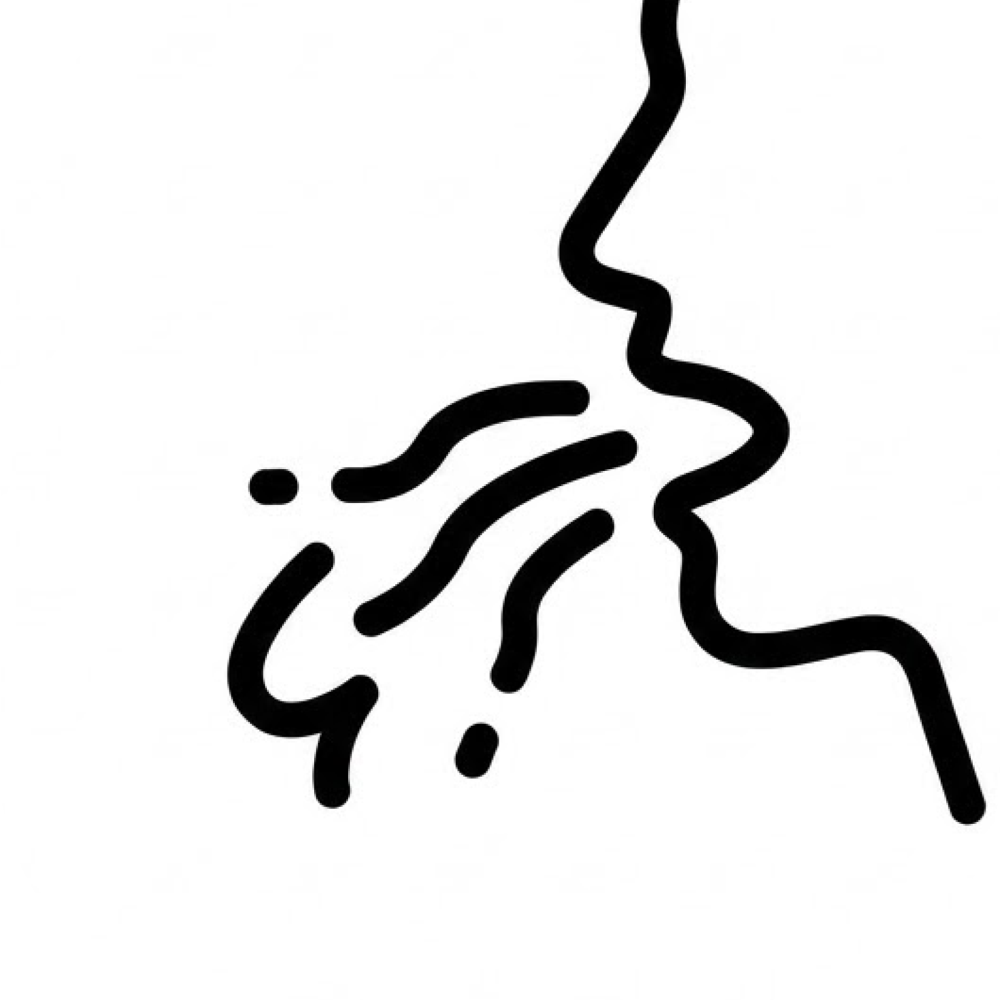
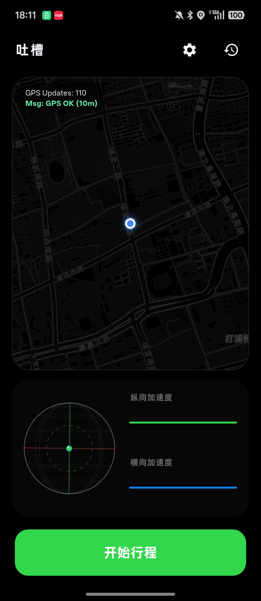
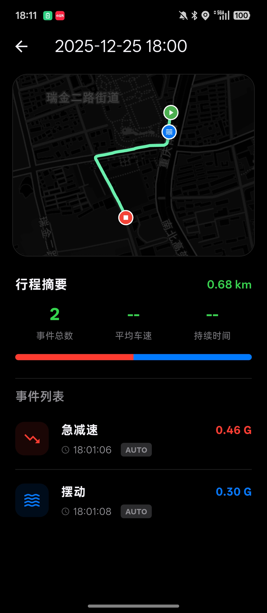
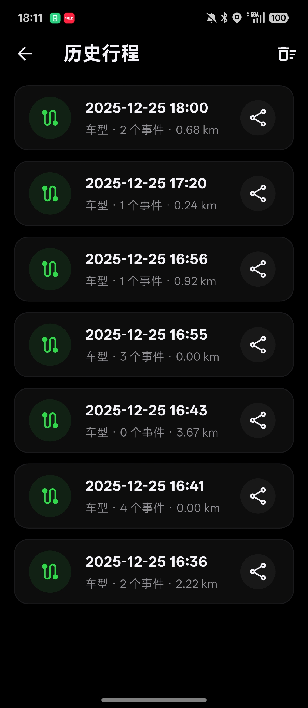

  
  <h1>Puked.</h1>
  
让行驶舒适度，从主观感受变为精密数据。

  
  <a href="https://github.com/maxliu/Puked/releases/latest" class="cta-button">免费下载 APK</a>
  
支持 Android 10.0+ · 100Hz 采样精度

  

    
    
    
  

  

    

      <h3>精密采样</h3>
      
100Hz 高频引擎，深度提取加速度计与陀螺仪原始数据，捕捉每一次细微震动。

    

    

      <h3>自动校准</h3>
      
无视手机摆放角度。静态重力对齐算法自动将数据投影至车辆坐标系。

    

    

      <h3>回溯记录</h3>
      
感知不适瞬间，点击即可捕获前 10 秒真值。为算法迭代提供最真实的主观标定。

    

    

      <h3>极简交互</h3>
      
专为车内弱交互场景设计的深色 UI 与全方位触觉反馈。让专注回归驾驶本身。

    

  

  <footer style="margin-top: 6rem; padding-bottom: 4rem; border-top: 1px solid #f5f5f7; padding-top: 2rem;">
    

      基于 GPL-3.0 开源 · 隐私第一 · 所有数据本地存储 
      © 2024 Puked Team.
    

  </footer>

